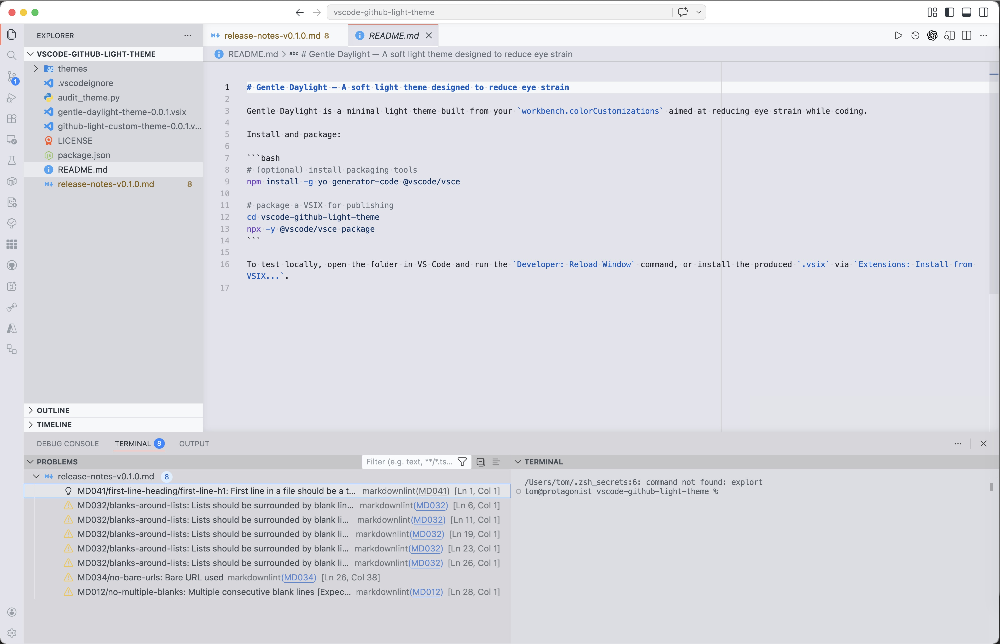

# Gentle Daylight (VS Code theme)
**A soft light VS Code theme designed to reduce eye strain**

Gentle Daylight is a minimal light theme built from your `workbench.colorCustomizations` aimed at reducing eye strain while coding.

## Preview



## Features

- Soft, low-contrast UI and editor colors
- Readable syntax color choices
- Lightweight and unobtrusive

## Installation

From a local VSIX (packaged):

```bash
npx -y @vscode/vsce package
code --install-extension gentle-daylight-theme-0.1.2.vsix
```

## Activate the theme

1. Open the Command Palette (Ctrl/Cmd+Shift+P)
2. Run `Preferences: Color Theme`
3. Select `Gentle Daylight`

## Customize

Example `settings.json` snippet:

```json
"workbench.colorCustomizations": {
	"editor.background": "#fbfbfb",
	"editor.foreground": "#2b2b2b"
}
```

## Contributing

Contributions are welcome — open an issue or submit a pull request at https://github.com/krahd/gentle-daylight-theme

## Support

Report bugs and request features on GitHub: https://github.com/krahd/gentle-daylight-theme/issues

## License

See `LICENSE` for license details.
